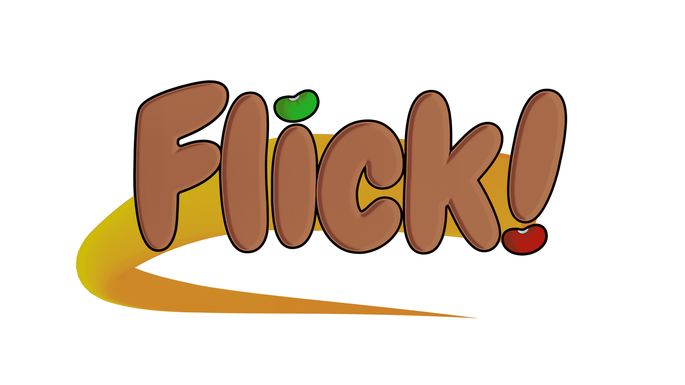

# Flick!

Flick is an open source 2D platformer game made with the Godot game engine (version 4.x).
The game itself involves the titular character, Flick, being thrust out of his couch potato lifestyle to protect his home from the evil weed overlord, Oliv Garc. Flick is granted a power from a unsuspecting partner the ability to launch in any direction via a flick from the player. How will Flick utilize this power to save his home and lifestyle?

## How Flick Came to Be

Originally, Flick! was a project a friend and I were planning to make years ago when we wanted to get into game development. However, both my friend and I took different career paths and I took ownership of the project. Nowadays, as I try to make games again, I wanted to make use of the idea we had for this game, but I didn't want to commit as much time to it as the other game I want to make. To compromise, I decided to make this game open source, hoping that I can keep the idea of the game alive, while making it easier for my contributions, while also providing the Godot community with a tool they can use for their games.

To learn more about this project, visit https://codernunk.com/projects/#flick!

## Game Design Documentation

To understand the rationale behind the game mechanics and how the game is generally designed, refer to this
[Game Design Documentation](.gdd/GAME_DESIGN.md) here.

## Getting Started

### Prerequisites (Godot, Git)

Flick! is currently being developed with Godot _version 4.2_.

Follow the instructions on the Godot Engine website to download this version of the Godot Engine: https://godotengine.org/

In addition, to work with version control, download and install Git here: https://git-scm.com/

### Download or Clone the Repository

This can be done by copying the HTTPS URL on the GitHub repository, and then using Git to clone a copy on your local machine. Click the Code button on the GitHub website or copy this URL - https://github.com/codernunk/flick.git, and then invoke the Clone function with your Git client of choice. I typically use [TortoiseGit](https://tortoisegit.org/) on Windows or [Visual Studio Code](https://code.visualstudio.com/)'s Source Control explorer.

### Opening the Game

Once you have cloned the repository, opening the game in the Godot editor is simple. Open Godot, and then use the Import directory feature on the home page to locate the Flick! project. Godot should now open the project and import all the assets on your local machine!

### Exporting the Game

TBD

### 3D Assets and Sprite Sheets

If you are looking to view or modify the game assets, you'll need Blender to view the 3D models. Follow the download instructions on the Blender website to install it for yourself: https://www.blender.org/download/

In addition, most 3D assets are converted into 2D sprite sheets using a batch script. ImageMagick, a command line interface (CLI) tool, is used to compile all the exported sprite images from Blender into a single sprite sheet image. Follow the download instructions on the ImageMagick website to install it: https://imagemagick.org/script/download.php

If you would like to know how to generate the sprite sheets, I prepared the following tutorials:

- https://youtu.be/_J5okZLZzFY
- a written version if that's more your style: https://codernunk.com/tutorials/sprite-sheet-from-3d/

## Codebase Documentation

Whether you plan to contribute, or are just using Flick! as an example project to get your own game up and running, we've provided some documentation on why and how the project is set up the way it is. In addition to that, there are also a set of best practices and naming conventions provided to help you follow along.

### Project Structure

The project will be roughly structured as follows:

- .assets/ - These are raw art and sound files used to generate the final assets. This folder needs to be versioned, but will be excluded from the final exported game.
- scenes/
  - worlds/
    - 1/
      - ... all assets and scenes shared by World 1
      - 1_1.tscn, 1_2.tscn, 1_3.tscn...
  - player/
    - player.tscn
    - player.gd
    - player sprites
    - player sound effects
  - bean/
  - main_menu/
  - ...
- global/
  - audio/
    - sounds/
      - Some audio would go here if it's used in multiple places. Otherwise the sound files can go next to the scene they are used by
    - music/
  - fonts/
  - shaders/
  - particles/
    - These are sprites used for particle effects, which may get organized properly later.
  - sky/
    - This is just sky textures used for backgrounds. I may organize this better later.
  - scripts/
    - These would be AutoLoad scripts or script files that define constants, enums, etc.

This project uses an approach that groups the sprites, sounds, etc with the scenes that use them. Sometimes, scenes will be more "global", meaning they are used everywhere. For those, they will be organized accordingly.

The goal of this organization approach is to promote decoupling as much as possible. Another benefit of this approach is that all the relevant assets are right next to the scene that uses them, so you don't need to sift through folders to drag assets into the scene editor.

A disadvantage of this approach is that it'll create more nested folders, and may not be as intuitive. To mitigate this, utilize Godot's Quick Open function or other search functions to look for assets.

I'm open to adjust this organization in the future if we feel like it does the project a disservice.

This organization structure is based heavily on Godot's official recommendation: https://docs.godotengine.org/en/stable/tutorials/best_practices/project_organization.html

### Best Practices

These are by no means mandatory to follow, but rather, guides that help us write clean code. When eventually reviewing pull requests, this guide will be used as the basis of the review. Sometimes, there may be conflicts to the best practices, but that's OK! They'll be reviewed on a case-by-case basis. We will do the best we can to explain why we broke a best practice when doing so.

This section will evolve as the project evolves.

#### Put Assets Next to Scenes Using Them

Like mentioned in the [Project Structure](#project-structure) section, we will use the Godot documentation's way of organizing the project. Please see the documentation for more information: https://docs.godotengine.org/en/stable/tutorials/best_practices/project_organization.html

#### Always Statically Type Variables

I recommend using the static typing feature of GDScript as much as possible. Not only does it help the intellisense, it also has performance benefits. However, I will not be too stingy about it if we use non-statically typed variables as loop iterators, for example. If a variable is used temporarily, I don't always statically type it either.

#### Use Signals Over Direct References

As a general rule of thumb, whenever two or more scenes need to communicate, I recommend using signals. For scenes that use signals from their child components, I think it's much cleaner to set up the signal directly in the editor. However, it's also fine to connect the signals through code. as it may not always be possible to do so in the editor (for example, any scenes that are instanced on the fly).

As far as scenarios when to not use signals, I recommend reading GDQuest's article on it. We will use the same approach here. In summary, signals are not the best used when they have to be bubbled down multiple scenes, or when it takes multiple steps to connect the signal. The article can be found here: https://www.gdquest.com/tutorial/godot/best-practices/signals/

## Contributing

As of right now, Flick! is NOT allowing contributors. However, it will in the future. Star this repository to keep posted for updates!

Please read [CONTRIBUTING.md](CONTRIBUTING.md) for details on the code of conduct, and the process for submitting pull requests.

## License

The source code for this project is licensed under the MIT License - see the [LICENSE](LICENSE) file for details.

The assets themselves - characters, enemies, and collectables are all licensed under the CC-BY-4.0 license. This means that you may use these assets in fan works and derivative content, but you must provide attribution.

More details can be found in [COPYRIGHT.txt](COPYRIGHT.txt).

## Promotional Materials

Before I decided to make the game open source, I made a website to promote the game for use as an application to a game convention: https://flick.nunkware.digital/. This website will remain open as a reference for those looking to build their own games. I'll eventually look into migrating the website over to GitHub hosting so it can remain here.

## Relevant Tutorials

Before making Flick! open source, I made a few tutorials on my YouTube channel covering some of the processes I used to implement game mechanics. You can find the relevant tutorials here:

- Making the Sprites: https://youtu.be/ctJLhgEp3gM
- Making the Sprite Sheets: https://youtu.be/_J5okZLZzFY or https://codernunk.com/tutorials/sprite-sheet-from-3d/
- Making the Flick Mechanic: https://youtu.be/-BhiXtR4k0I
- Making the Land Without Tilemaps: https://youtu.be/3mFLDT04-qM
- Making the Trail Effect: https://youtu.be/Bhc_EBasycY
- Making the Ground Pound: https://youtu.be/dW6EZiMwe04
- Making the Spring: https://youtu.be/upX-pFfaeJ0
- Making the Loading Screen: https://youtu.be/n0HXRToIZBc
- Making the Level Select Screen: https://youtu.be/gjXnfKhNOmw
- Making the Spuds (Collectable Buddies): https://youtu.be/aBitrcJ6BEQ

## Thank You and Acknowledgements

- Thank you to the Godot Engine team for creating the game engine used for this project!
- Thank you YouTube subscribers and Godot community members for supporting the CoderNunk channel!
- Thank YOU for being here to make games with us!
